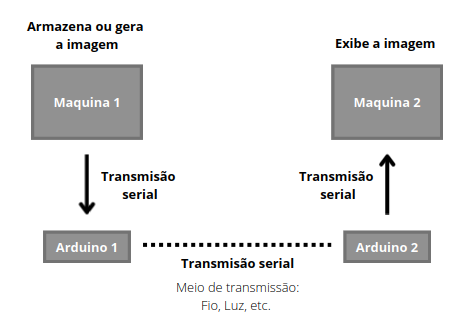

<h1> Image Transfer </h1>

Este é um projeto que usa comunicação serial, microcontroladores e scripts python para criar uma interface de envio de imagens entre dois computadores. A ideia é ter uma maquina que gera ou armazena imagens e as envia através da interface para uma segunda maquina que as exibe. 

 </img>

<h2> Fluxo dos dados </h2>

Transmissão da imagem:

A imagem pode ser lida da memória através da biblioteca PILOW ou pode ser capturada na webcam através da biblioteca OPENCV2. Para transmitir as imagens é necessário transforma-las em sequências de bytes e depois usar a biblioteca PySerial para escolher a porta onde será feita a transmissão serial.
Os bytes são recebidos pelo arduino e enviados por sua porta serial. A grande vantagem de usar um arduino é que possivel acoplar circuitos em sua saida e realizar a transmissão por diversos meios (fio, luz etc).

Recebimento da imagem:

A sequencia de bytes chega ao segundo arduino, que a retransmite para o segundo computador. Nele é utilizada biblioteca PySerial para ler os dados através da porta escolhida e então usa-se a bibliotec PILOW para exibir a imagem na tela.
